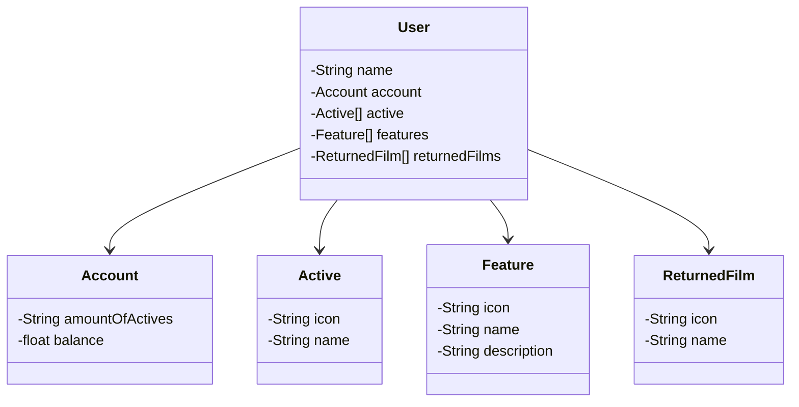

# Blockduster Movies 
Java RESTful API to represent an online movie store

## Class Diagram

```mermaid
classDiagram
    class User {
        -String name
        -Account account
        -Active[] active
        -Feature[] features
        -ReturnedFilm[] returnedFilms
    }

    class Account {
        -String amountOfActives
        -float balance
    }

    class Active {
        -String icon
        -String name
    }

    class Feature {
        -String icon
        -String name
        -String description
    }

    class ReturnedFilm {
        -String icon
        -String name
    }

    User --> Account
    User --> Active
    User --> Feature
    User --> ReturnedFilm
```
